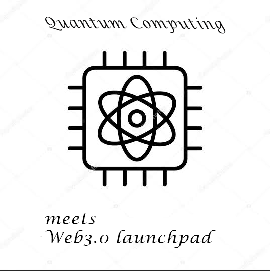

<!DOCTYPE html>
<html lang="en">

  <head>
    <meta charset="UTF-8">
    <meta name="viewport" content="width=device-width, initial-scale=1.0, shrink-to-fit=no">
    <meta name="description" content="AmeStarter is a Web3.0 launchpad built on AmeChain factoring to bring in the next tranche of innovations to the Blockchain space. Commited to full and true Decentralization and ideas building taking security as paramount by building on a scalable Quantum resistant Blockchain.">
    <meta name="author" content="">
    <link rel="preconnect" href="https://fonts.googleapis.com">
    <link rel="preconnect" href="https://fonts.gstatic.com" crossorigin>
    <link href="https://fonts.googleapis.com/css2?family=Roboto:wght@100;300;400;500;700;900&display=swap" rel="stylesheet">
    <title>AmeStarter - The Web3.0 launchpad on AmeChain</title>

    <!-- Bootstrap core CSS -->
    <link href="vendor/bootstrap/css/bootstrap.min.css" rel="stylesheet">

    <!-- Additional CSS Files -->
    <link rel="stylesheet" href="https://use.fontawesome.com/releases/v5.8.1/css/all.css" integrity="sha384-50oBUHEmvpQ+1lW4y57PTFmhCaXp0ML5d60M1M7uH2+nqUivzIebhndOJK28anvf" crossorigin="anonymous">
    <link rel="stylesheet" href="assets/css/styles.css">
    <link rel="stylesheet" href="assets/css/animated.css">
    <link rel="stylesheet" href="assets/css/owl.css">

  </head>

<body>

  <!-- ***** Preloader Start ***** -->
  

    

      
      

        
        
        
      

    

  

  <!-- ***** Preloader End ***** -->

  <!-- ***** Header Area Start ***** -->
  <header class="header-area header-sticky wow slideInDown" data-wow-duration="0.75s" data-wow-delay="0s">
    

      

        

          <nav class="main-nav">
            <!-- ***** Logo Start ***** -->
            
            <!-- ***** Logo End ***** -->
            <!-- ***** Menu Start ***** -->
            <ul class="nav">
              <li class="scroll-to-section hover-underline-animation"><a href="#top" class="active">Home</a></li>
              <li class="scroll-to-section hover-underline-animation"><a href="#community">The Community</a></li>
              <li class="scroll-to-section hover-underline-animation"><a href="#developers">For Developers</a></li>
              <li class="scroll-to-section hover-underline-animation"><a href="#footer">Socials</a></li>
              <li>
<a id="modal_trigger" href="#"><i class="fa fa-sign-in-alt"></i> Launch App</a>
</li> 
            </ul>        
            <a class='menu-trigger'>
                Menu
            </a>
            <!-- ***** Menu End ***** -->
          </nav>
        

      

    

  </header>
  <!-- ***** Header Area End ***** -->
  
  

    

      

        

          

            

              

                

                  

                    <h2>Built on AmeChain, &nbsp; &nbsp; &nbsp; The first Web3.0 launchpad...</h2>
                    
AmeStarter is the first decentralized launchpad built on Amechain's Quantum resistant network, dedicated to Web3.0 innovations

                  

                 
                

              

            

            

              

                
              

            

          

        

      

    

  

  

    

      

        

          

            <h4>For the<em> Community</em></h4>
            
            
Gain first mover advantages and early access to new initiatives built on a sophisticated Quantum resistant chain.

          

        

      

    

    

      

        

          

            

            <h4>Total Decentralization</h4>
            
Decision making processes handled by the community via open votes in order to ensure a true 100% Decentralization

            

              <a href="#">Read More <i class="fa fa-arrow-right"></i></a>
            

          

        

        

          

            

            <h4>Filter Selection</h4>
            
Predetermined criterias to obfuscate the probabilities for malicious developers in order to protect the Community

            

              <a href="#">Read More <i class="fa fa-arrow-right"></i></a>
            

          

        

        

          

            

            <h4>Multi-Tier Flow</h4>
            
Tiered system that fits into the system to allocate for everyone an allocation in the ideas of tomorrow

            

              <a href="#">Read More <i class="fa fa-arrow-right"></i></a>
            

          

        

        

          

            

            <h4>24/7 Help &amp; Support</h4>
            
Community support materials and interaction to help onboard new users to AmeChain and AmeStarter

            

              <a href="#">Read More <i class="fa fa-arrow-right"></i></a>
            

          

        

      

    

  

  

    

      

        

          

            <h4>For <em>Developers</em></h4>
            
            
Tap into Amechain's liquidity and community to bring your project and ideas to reality.

          

          

            

              

                <h4><a href="#">Fragmented Liquidity</a></h4>
                
Get access to funding to kickstart your idea

              

            

            

              

                <h4><a href="#">AmeStarter Services</a></h4>
                
Access to tools and personnel before &amp; after launch

              

            

            

              

                <h4><a href="#">Incubation Resources</a></h4>
                
First time? Let's work on improving the concept

              

            

            

              

                <h4><a href="#">Community Exposure</a></h4>
                
Gain exposure to AmeChain's &amp; AmeStarter large fan base

              

            

            

              
There is always a vetting process to be conducted by the team and elected council acting as the Quango before selection and further talks will be initiated   Do well to fill out the details completely and precisely

              

                <a href="https://forms.gle/Xp7BMev8qCko5aMU7" target="_blank">Click to Apply</a>
              
  
              *Communication takes less than 3 days
            

          

        

        

          

            
          

        

      

    

  

  <footer id="footer">
    

      

        

          

            <h4>Join our Vibrant communities to stay in the loop on new &amp; upcoming launches</h4>
          

        

        <!-- Partners and Team info to be updated in real time very soon! -->
      

        

          

            <h4>Socials and all</h4>
            
<a href="https://twitter.com/amestarter" target="_blank" class="fab fa-twitter"> Twitter</a>

            
<a href="https://github.com/Amestarter/" target="_blank" class="fab fa-github"> Github</a>

            
<a href="https://t.me/amestarter" target="_blank" class="fab fa-telegram"> Telegram</a>

            
<a href="https://medium.com/@amestarter" target="_blank" class="fab fa-medium"> Medium</a>

          

        

        

          

            <h4>Contact Us</h4>
            <ul>
              <li> <a href="mailto:business@amestarter.com" target="_blank">Business Enquiries?</a></li>
              <li><a href="mailto:business@amestarter.com" target="_blank"> Business Link</a></li>
              <li> <a href="mailto:support@amestarter.com" target="_blank">Queries, Complaints?</a></li>
              <li><a href="mailto:support@amestarter.com" target="_blank"> Support Line</a></li>
            </ul>
            
          

        

        

          

            <h4>Useful Links</h4>
            <ul>
              <li><a href="#">Launchpad</a></li>
              <li><a href="https://docs.amestarter.com" target="_blank">Whitepaper</a></li>
              <li><a href="#">Roadmap</a></li>
            </ul>
            <ul>
              <li><a href="#">Team Profile</a></li>
              <li><a href="#">Development</a></li>
              <li><a href="#">CoinmarketCap</a></li>
            </ul>
          

        

        

          

            <h4>About the Project</h4>
            

              
            

            
...the first decentralized cryptocurrency launchpad on the Amechain Quantum resistant network

          

        

        

          

            
Building a true Web3.0 on AmeChain

          

        

      

    

  </footer>

  <!-- Scripts -->
  
  
  
  
  
  
  
</body>
</html>